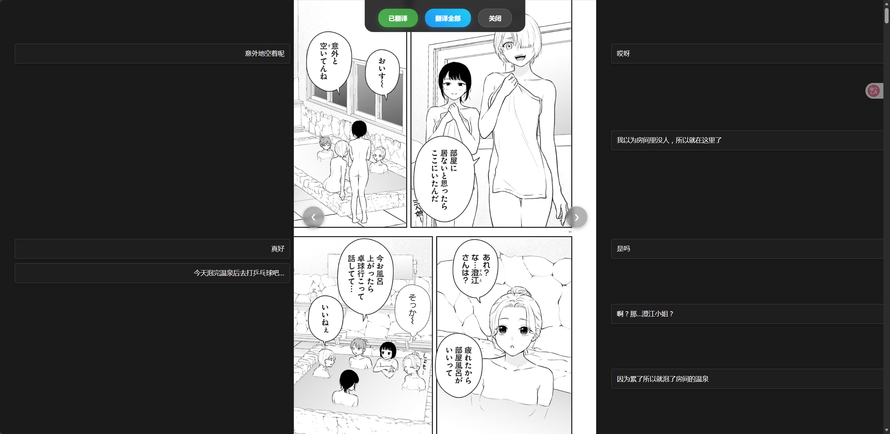
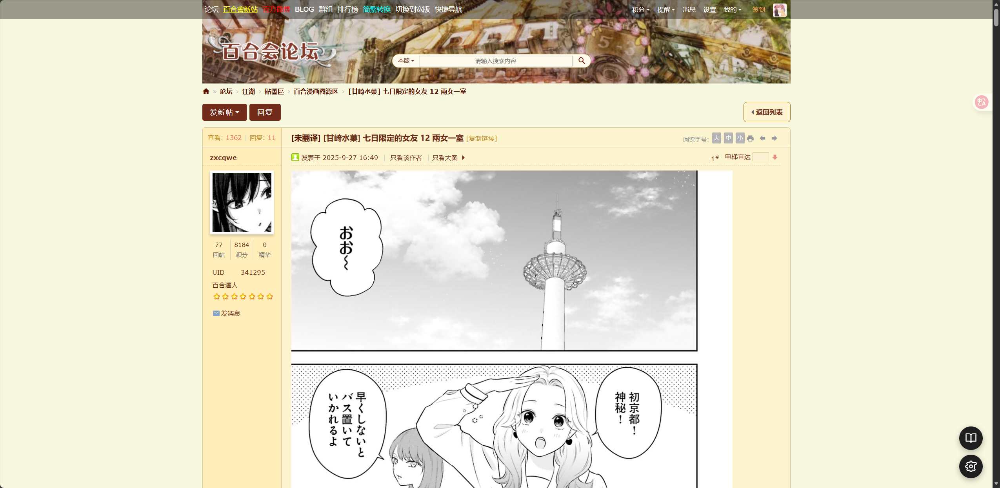
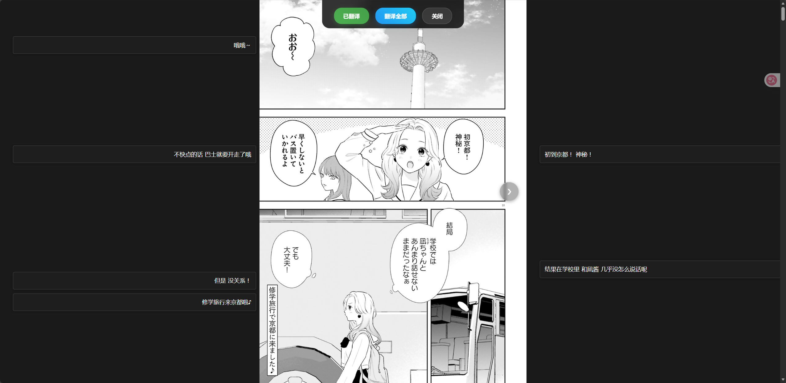

# VTranslate - AI 漫画/图片翻译脚本

VTranslate 是一个基于 AI 的 Tampermonkey (油猴) 脚本，专为百合会论坛漫画和图片翻译设计。利用大语言模型的视觉能力，自动识别图片中的文本并将其翻译为简体中文。

## 功能特性

- **AI 翻译**：支持 OpenAI 兼容接口（如 Qwen, ChatGPT, Claude 等），精准识别并翻译图片文字。
- **阅读模式**：
  - **三栏布局**：左侧翻译、中间图片、右侧翻译。
  - **智能对齐**：翻译文本根据图片中的垂直位置自动排列，左侧文本右对齐，右侧文本左对齐，紧贴图片。
  - **防重叠**：自动调整文本位置，防止翻译结果相互覆盖。
  - **自适应宽度**：图片区域根据屏幕和图片比例自动调整，最大化阅读视野。
- **高效操作**：
  - **一键全页翻译**：支持批量翻译当前页面的所有图片（支持并发控制）。
  - **智能缓存**：自动缓存翻译结果，刷新页面或再次浏览不消耗 API 额度。
  - **便捷导航**：支持键盘左右键、鼠标滚轮（带防抖）快速翻页。
  - **上下文感知**：自动获取页面标题作为翻译上下文，提高翻译准确度。
- **灵活配置**：
  - 内置设置面板，可自定义 API Endpoint、API Key、模型名称和温度。

## 📥 安装指南

1. **安装浏览器扩展**：
   请先安装 [Tampermonkey](https://www.tampermonkey.net/) 扩展。

2. **安装脚本**：
    安装好 Tampermonkey 后，点击 [脚本链接](https://github.com/TnZzZHlp/VTranslate/raw/refs/heads/main/vtranslate.user.js) 即可自动安装

## 配置说明

首次使用时，可以使用内置服务(不保证可用性)，或者点击页面右下角的浮动设置按钮（⚙️），配置您的 AI 服务信息：

- **API Endpoint**: OpenAI 兼容的接口地址 (例如: `https://api.openai.com/v1/chat/completions` 或第三方中转地址)。
- **API Key**: 您的 API 密钥。
- **Model**: 使用的模型名称 (推荐支持视觉的模型，如 `gpt-4o`, `claude-3-5-sonnet`, `gemini-1.5-pro` 等)。
- **Temperature**: 随机性。

## 使用说明

1. **进入阅读模式**：
   在包含漫画或图片的页面，点击右下角的 **"📖"** 浮动按钮进入阅读模式。
    

2. **翻译图片**：
   - **单张翻译**：点击顶部控制栏的 **"翻译当前"** 按钮。
   - **批量翻译**：点击顶部控制栏的 **"翻译全部"** 按钮，脚本将自动队列处理所有图片。
    

3. **翻页导航**：
   - **鼠标**：鼠标移入图片区域，点击左右两侧出现的箭头按钮。
   - **滚轮**：直接滚动鼠标滚轮切换上一张/下一张。
   - **键盘**：使用 `←` (左箭头) 和 `→` (右箭头) 键。

## 本地开发

本项目使用 Vite + TypeScript 开发。

```bash
# 1. 克隆项目
git clone https://github.com/your-username/VTranslate.git
cd VTranslate

# 2. 安装依赖
pnpm install

# 3. 启动开发服务器
pnpm dev

# 4. 构建生产版本
pnpm build
```

构建完成后，产物位于 `dist/vtranslate.user.js`。

## 许可证

MIT License
